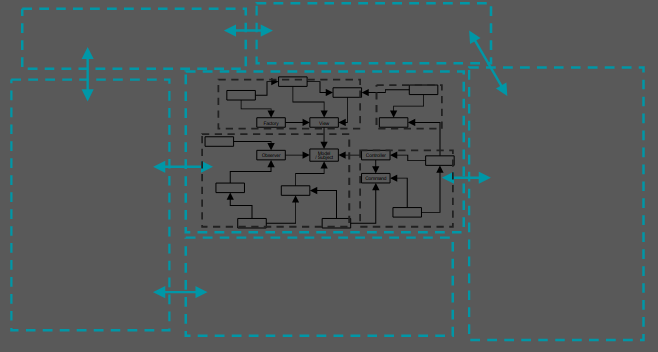

# **Programação WEB**
Introdução aos conceitos de arquitetura e padrões de software

---
# Arquitetura de software
É a estrutura ou estruturas do sistema, que compreendem elementos de software, as propriedades externamente visíveis desses elementos e as relações entre eles. 

---

# Arquitetura de Sistemas WEB

Arquitetura de software inclui as decisões de projeto mais importantes em um sistema.

Arquitetura não é apenas um conjunto de módulos, mas um conjunto de decisões. Dentre essas decisões, inclui-se:
* a definição dos módulos principais de um sistema. 
* escolha da linguagem de programação 
* banco de dados que serão usados no desenvolvimento

---

# Questões de design
- Como adiciono um item de menu?
- Como posso facilitar a adição de itens de menu ?
- Qual bloqueio protege esses dados?
- Como o Google classifica as páginas?
- Qual codificador devo usar para comunicação segura?
- Qual é a interface entre os objetos? 

---
# Padrões de Projetos
- São soluções generalistas para problemas recorrentes durante o desenvolvimento de um software.
- uma definição de alto nível de como um problema comum pode ser solucionado.

---

REF: https://www.java67.com/2012/09/top-10-java-design-pattern-interview-question-answer.html

--- 

# Padrões arquiteturais

- propõem uma organização de mais alto nível para sistemas de software, incluindo seus principais módulos e as relações entre eles.

--- 
# Arquitetura

--- 
# Tipos de Arquitetura
- Camadas
- Monoliticas
- Arquitetura em Três Camadas
- Microserviços

---
# Arquitetura de Camadas
- Os componentes do sistema são organizadas em módulos de maior tamanho, chamados de camadas. As camadas são dispostas de forma hierárquica e uma camada somente pode usar serviços da camada imediatamente inferior.  Isso ajuda no entendimento, manutenção e evolução de um sistema. 

---
# Arquitetura Monoliticas
- Um único executável monolítico, no qual toda a modularização utilizada é executada em uma mesma máquina. Assim, os módulos compartilham recursos de processamento, memória, bancos de dados e arquivos. 

- Apenas ums Tier comum nos mainframes que centralizava todo o processo. Outro exemplo são os softwares puramente desktops. 
  
- ---
# Arquitetura em Três Camadas

As três camadas dessa arquitetura são as seguintes:

---

# Arquitetura em Três Camadas
- **Interface com o Usuário:** 
  - também chamada de camada de apresentação. Responsável por toda interação com o usuário. Ela trata tanto da exibição de informação, como da coleta e processamento de entradas e eventos de interfaces, tais como cliques em botões, marcação de texto, etc. 

--- 
# Arquitetura em Três Camadas

- **Lógica de Negócio:** também conhecida como camada de aplicação, implementa as regras de negócio do sistema. No sistema acadêmico que estamos usando como exemplo, podemos ter a seguinte regra de negócio: cabe à camada de lógica verificar se uma determinada regra é obedecida.Ex: Aapós o lançamento de qualquer nota, os alunos devem ser avisados por meio de um e-mail.

--- 
# Arquitetura em Três Camadas

- **Banco de Dados:** armazena os dados manipulados pelo sistema. Por exemplo, no  sistema acadêmico, após lançamento e validação das notas, elas são salvas em um banco de dados.
  
--- 
# Padrão MVC (Model-View-Controller) 

- Define que as classes de um sistema devem ser organizadas em três grupos:

- **Visão:** 
- **Controladoras:**  
- **Modelo:** 
--- 

MVC:

--- 
# MVC
- **Visão:** classes responsáveis pela apresentação da interface gráfica do sistema, incluindo janelas, botões, menus, barras de rolagem, etc.

- **Controladoras:**  Controladoras podem solicitar uma alteração no estado do Modelo ou da Visão. 

- **Modelo:** classes que armazenam os dados manipulados pela aplicação e que têm a ver com o domínio do sistema em construção. Classes de modelo não têm qualquer conhecimento para classes de Visão e Controladoras. 

--- 
# vantagens de arquiteturas MVC:

- MVC favorece a especialização do trabalho de desenvolvimento. Por exemplo, desenvolvedores de classes de Modelo não precisam conhecer e implementar código de interface com usuários.

- MVC permite que classes de Modelo sejam usadas por diferentes Visões. Exemplo, um objeto de Modelo armazena dois valores: hora e minutos. Esses dados são apresentados em duas visões diferentes. Na primeira, como um relógio analógico. Na segunda, como um relógio digital.

---
#  Diferença entre Arquitetura 3 Camadas e Padrão MVC

Conceitualmente, a arquitetura de três camadas é linear. No entanto, a arquitetura MVC [Model-view-controller] é triangular: a visão envia atualizações Para o controlador, o controlador atualiza o modelo e o A visualização é atualizada diretamente do modelo. E  m uma arquitetura MVC, a interface gráfica é formada por objetos de visão e por controladores. Porém, em muitos sistemas não existe uma distinção clara entre Visão e Controladores. 

---
# Microsserviços

Sistemas, via de regra, seguem em tempo de execução uma arquitetura monolítica. Ou seja, mesmo que o desenvolvimento tenha sido particionado em módulos M1, M2, M3, …, Mn, em tempo de execução esses módulos são executados, pelo sistema operacional, como um processo único. Assim, todos os módulos compartilham o mesmo espaço de endereçamento. Em outras palavras, em tempo de execução o sistema é um grande monolito.

--- 

--- 

# Vantagens do microserviços

 - eles permitem a evolução mais rápida e independente de um sistema, permitindo que cada time tenha seu próprio regime de liberação de novas releases; 
  - eles permitem escalar um sistema em um nível de granularidade mais fino do que é possível com monolitos.
 - Como os microsserviços são autônomos e independentes eles podem ser implementados em tecnologias diferentes 
 - Quando se usa um monolito, falhas são totais. Por outro lado, em arquiteturas baseadas em microsserviços podemos ter falhas parciais. 

--- 
# Quando não usar
Ao usar microsserviços, temos que enfrentar todos os desafios que aparecem quando se implementa um sistema distribuído
- Complexidade
- Latência 
- Transações Distribuídas
- 
---

---
# Arquitetura de integração de sistemas
- As APIs são uma forma de integrar sistemas, permitindo que haja troca de informações entre sistemas com diferentes linguagens de programação, garantindo a segurança dos dados e oferecendo possibilidade de monetização dos acessos à API propriamente dita.
- muitos dos microsserviços utilizados no dia a dia utilizam APIs para se comunicarem entre si.

---

APIs envolvem a requisição de funções dentro de um programa, o que acontece por meio de diversos protocolos e rotas, retornando como respostas dados JSON e XML.

--- 
# API 

API Web: são APIs que se comunicam por meio de redes e podem ser combinados para a execução de operações complexas, utilizando principalmente o HTTP (Hyper Text Transfer Protocol), protocolo de comunicação responsável pela transferência de dados e fornecem uma definição da estrutura das mensagens de resposta. Essas mensagens de resposta geralmente têm o formato de arquivo XML ou JSON.

 --- 
# API 

Para acessar o serviço de uma API WEB, geralmente usa um endpoint que corresponde a URL onde seu serviço pode ser acessado por uma aplicação cliente. Um endpoint contém três principais características: Address (onde o serviço está hospedado), Binding (como o serviço pode ser acessado) e Contract (o que tem no serviço). 

Para que uma solicitação efetiva seja processada pelo terminal, o cliente deve fornecer um localizador uniforme de recursos ( URL ), um método, uma lista de cabeçalhos e um corpo.

---
Uma API tem a descrição de como as pessoas vão usar. 

[VIdeo sobre API](https://www.youtube.com/watch?v=TSLoQzJ-6mw)

[VIdeo sobre API 2](https://www.youtube.com/watch?v=ghTrp1x_1As)